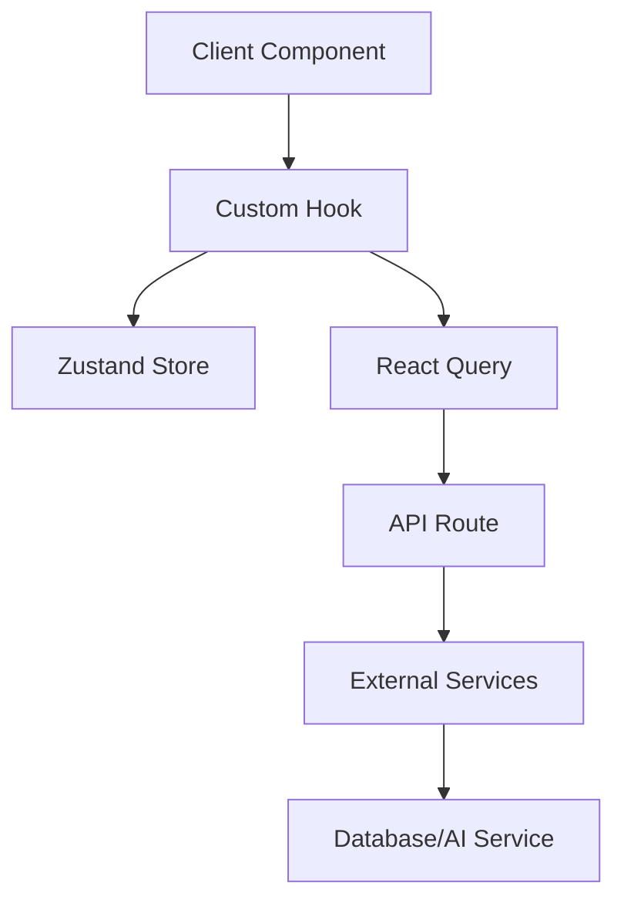

I'll help create a comprehensive update to the AI context documentation based on the codebase analysis. Here's a structured breakdown:

# AI-Powered Requirements Engineering Platform Documentation

## 1. Architecture Overview

### 1.1 Core Architecture Patterns

- **Frontend Framework**: Next.js 14 with App Router
- **State Management**: Layered approach combining:
  - Zustand for global state
  - React Query for server state
  - Context for service dependencies
  - Local state for component-specific needs

### 1.2 Key Design Patterns

1. **Service Layer Pattern**
```typescript
// Example from AIService
interface ServiceLayer {
  prepareContext(): Promise<Context>;
  executeOperation(): Promise<Result>;
  handleError(error: Error): void;
}
```

2. **Repository Pattern** - Seen in hooks like useRequirements:

```15:149:src/hooks/db/useRequirements.ts
export function useRequirements(projectId: UUID, options: UseRequirementsOptions = {}) {
  ...
  // Set up EventSource for real-time updates
  useEffect(() => {
    const eventSource = new EventSource(`/api/db/requirements?projectId=${projectId}&subscribe=true`);

    eventSource.onmessage = (event) => {
      const payload = JSON.parse(event.data);
      const newData = payload.new;
      const oldData = payload.old;

      if (newData?.project_id === projectId) {
        queryClient.invalidateQueries({ queryKey: ['requirements', projectId] });
        if (payload.eventType === 'DELETE' && oldData) {
          queryClient.removeQueries({ queryKey: ['requirement', oldData.id] });
        }
      }
    };

    return () => {
      eventSource.close();
    };
  }, [projectId, queryClient]);

  // Filter requirements based on the store's filters
  const filteredRequirements = requirements.filter(requirement => {
    if (filters.status.length > 0 && !filters.status.includes(requirement.status)) {
      return false;
    }
    if (filters.priority.length > 0 && !filters.priority.includes(requirement.priority)) {
      return false;
    }
    if (filters.assigned_to && requirement.assigned_to !== filters.assigned_to) {
      return false;
    }
    if (filters.search) {
      const searchLower = filters.search.toLowerCase();
      return (
        requirement.title.toLowerCase().includes(searchLower) ||
        requirement.description?.toLowerCase().includes(searchLower)
      );
    }
    return true;
  });
```


3. **Provider Pattern** - Used for service and theme context:
```typescript:src/lib/context/ServiceContext.tsx
startLine: 7
endLine: 47
```

### 1.3 Data Flow Architecture



## 2. State Management Strategy

### 2.1 Zustand Store Structure

The application uses a modular store approach:


```1:46:src/lib/store/appStore.ts
import { create } from 'zustand';
import { devtools, persist } from 'zustand/middleware';

interface AppState {
    theme: 'light' | 'dark';
    sidebarOpen: boolean;
    notifications: boolean;
    isLoading: boolean;
    loadingText: string | null;
    error: string | null;
    setTheme: (theme: 'light' | 'dark') => void;
    toggleSidebar: () => void;
    toggleNotifications: () => void;
    setLoading: (isLoading: boolean, text?: string | null) => void;
    setError: (error: string | null) => void;
    clearError: () => void;
}

export const useAppStore = create<AppState>()(
    devtools(
        persist(
            (set) => ({
                theme: 'light',
                sidebarOpen: true,
                notifications: true,
                isLoading: false,
                loadingText: null,
                error: null,
                setTheme: (theme) => set({ theme }),
                toggleSidebar: () => set((state) => ({ sidebarOpen: !state.sidebarOpen })),
                toggleNotifications: () => set((state) => ({ notifications: !state.notifications })),
                setLoading: (isLoading, text = null) => set({ isLoading, loadingText: text }),
                setError: (error) => set({ error }),
                clearError: () => set({ error: null })
            }),
            {
                name: 'app-settings',
                partialize: (state) => ({
                    theme: state.theme,
                    sidebarOpen: state.sidebarOpen,
                    notifications: state.notifications
                })
            }
        )
    )
);
```


### 2.2 State Categories

1. **UI State** (Zustand)
- Theme preferences
- Sidebar state
- Loading states
- Error messages

2. **Domain State** (React Query)
- Requirements data
- Project information
- User data

3. **Server State** (React Query)
- API responses
- Real-time updates
- Cache management

## 3. Real-time Architecture

### 3.1 SSE Implementation
```typescript
interface RealTimeConfig {
  endpoint: string;
  handlers: {
    onMessage: (data: any) => void;
    onError: (error: Error) => void;
  };
  options?: {
    reconnect: boolean;
    reconnectInterval: number;
  };
}
```

### 3.2 Real-time Updates Pattern

```109:128:src/hooks/db/useRequirements.ts
  useEffect(() => {
    const eventSource = new EventSource(`/api/db/requirements?projectId=${projectId}&subscribe=true`);

    eventSource.onmessage = (event) => {
      const payload = JSON.parse(event.data);
      const newData = payload.new;
      const oldData = payload.old;

      if (newData?.project_id === projectId) {
        queryClient.invalidateQueries({ queryKey: ['requirements', projectId] });
        if (payload.eventType === 'DELETE' && oldData) {
          queryClient.removeQueries({ queryKey: ['requirement', oldData.id] });
        }
      }
    };

    return () => {
      eventSource.close();
    };
  }, [projectId, queryClient]);
```


## 4. AI Integration

### 4.1 AI Service Architecture

```typescript
interface AIServiceConfig {
  endpoint: string;
  apiKey: string;
  options: {
    timeout: number;
    retries: number;
    rateLimiting: {
      maxRequests: number;
      windowMs: number;
    };
  };
}
```

### 4.2 Analysis Pipeline

```65:90:docs/ai-context.md
interface AnalysisContext {
  requirement: Requirement;
  relatedDocs: ExternalDoc[];
  regulations: Collection[];
  projectContext: Project;
}

interface AnalysisResult {
  suggestions: Array<{
    type: 'clarity' | 'completeness' | 'consistency' | 'compliance';
    content: string;
    confidence: number;
    relatedRegulations?: string[];
  }>;
  compliance: Array<{
    regulation: string;
    status: 'compliant' | 'non_compliant' | 'needs_review';
    details: string;
    suggestions?: string[];
  }>;
  traceability: Array<{
    requirementId: string;
    relationship: TraceLinkType;
    confidence: number;
  }>;
}
```


### 4.3 Rate Limiting Implementation

```6:9:src/app/api/ai/route.ts
const rateLimitMiddleware = rateLimit({
    maxRequests: 20, // 20 requests per minute
    windowMs: 60 * 1000 // 1 minute
});
```


## 5. Styling Architecture

### 5.1 Theme System
The application uses a CSS variables-based theming system:


```9:96:src/styles/globals.css
@layer base {
  :root {
    --background: 0 0% 100%;
    --foreground: 240 10% 3.9%;
    
    --card: 0 0% 100%;
    --card-foreground: 240 10% 3.9%;
    
    --popover: 0 0% 100%;
    --popover-foreground: 240 10% 3.9%;
    
    /* Red accent colors */
    --primary: 0 72% 51%;  /* Vibrant red */
    --primary-foreground: 0 0% 98%;
    
    --secondary: 0 0% 96%;
    --secondary-foreground: 240 5.9% 10%;
    
    --muted: 240 4.8% 95.9%;
    --muted-foreground: 240 3.8% 46.1%;
    
    --accent: 0 91% 71%;  /* Lighter red for accents */
    --accent-foreground: 0 0% 98%;
    
    --destructive: 0 84.2% 60.2%;
    --destructive-foreground: 0 0% 98%;

    /* Neutral colors */
    --border: 240 5.9% 90%;
    --input: 240 5.9% 90%;
    --ring: 0 72% 51%;  /* Matching primary red */

    /* Chart colors - Minimalistic palette */
    --chart-1: 0 72% 51%;    /* Primary red */
    --chart-2: 220 14% 96%;  /* Light gray */
    --chart-3: 240 10% 4%;   /* Near black */
    --chart-4: 0 0% 85%;     /* Medium gray */
    --chart-5: 0 91% 71%;    /* Light red */

    --radius: 0.5rem;

    --sidebar-background: 0 0% 98%;

    --sidebar-foreground: 240 5.3% 26.1%;

    --sidebar-primary: 240 5.9% 10%;

    --sidebar-primary-foreground: 0 0% 98%;

    --sidebar-accent: 240 4.8% 95.9%;

    --sidebar-accent-foreground: 240 5.9% 10%;

    --sidebar-border: 220 13% 91%;

    --sidebar-ring: 217.2 91.2% 59.8%;
  }

  .dark {
    --background: 240 10% 3.9%;
    --foreground: 0 0% 98%;
    
    --card: 240 10% 3.9%;
    --card-foreground: 0 0% 98%;
    
    --popover: 240 10% 3.9%;
    --popover-foreground: 0 0% 98%;
    
    /* Dark mode red accents */
    --primary: 0 72% 51%;  /* Keeping the same red */
    --primary-foreground: 0 0% 98%;
    
    --secondary: 240 3.7% 15.9%;
    --secondary-foreground: 0 0% 98%;
    
    --muted: 240 3.7% 15.9%;
    --muted-foreground: 240 5% 64.9%;
    
    --accent: 0 91% 71%;
    --accent-foreground: 240 5.9% 10%;
    
    --destructive: 0 62.8% 30.6%;
    --destructive-foreground: 0 0% 98%;

    /* Dark mode neutral colors */
    --border: 240 3.7% 15.9%;
    --input: 240 3.7% 15.9%;
    --ring: 0 72% 51%;
```


### 5.2 Color System

```36:55:src/styles/index.ts
export const colors = {
  red: {
    primary: 'hsl(0, 72%, 51%)',
    light: 'hsl(0, 91%, 71%)',
    dark: 'hsl(0, 62.8%, 30.6%)',
  },
  neutral: {
    50: 'hsl(0, 0%, 98%)',
    100: 'hsl(240, 4.8%, 95.9%)',
    200: 'hsl(240, 5.9%, 90%)',
    300: 'hsl(240, 5.9%, 80%)',
    400: 'hsl(240, 5.9%, 70%)',
    500: 'hsl(240, 5.9%, 60%)',
    600: 'hsl(240, 5.9%, 50%)',
    700: 'hsl(240, 3.8%, 46.1%)',
    800: 'hsl(240, 3.7%, 15.9%)',
    900: 'hsl(240, 10%, 3.9%)',
    950: 'hsl(240, 10%, 3.9%)',
  }
}
```


## 6. Component Architecture

### 6.1 Base Components
- Utilizes shadcn/ui as the foundation
- Implements compound component pattern
- Uses Radix UI primitives

Example of compound component pattern:

```1:54:src/components/ui/card.tsx
import * as React from "react"

import { cn } from "@/lib/utils"

const Card = React.forwardRef<
  HTMLDivElement,
  React.HTMLAttributes<HTMLDivElement>
>(({ className, ...props }, ref) => (
  <div
    ref={ref}
    className={cn(
      "rounded-xl border bg-card text-card-foreground shadow",
      className
    )}
    {...props}
  />
))
Card.displayName = "Card"

const CardHeader = React.forwardRef<
  HTMLDivElement,
  React.HTMLAttributes<HTMLDivElement>
>(({ className, ...props }, ref) => (
  <div
    ref={ref}
    className={cn("flex flex-col space-y-1.5 p-6", className)}
    {...props}
  />
))
CardHeader.displayName = "CardHeader"

const CardTitle = React.forwardRef<
  HTMLDivElement,
  React.HTMLAttributes<HTMLDivElement>
>(({ className, ...props }, ref) => (
  <div
    ref={ref}
    className={cn("font-semibold leading-none tracking-tight", className)}
    {...props}
  />
))
CardTitle.displayName = "CardTitle"

const CardDescription = React.forwardRef<
  HTMLDivElement,
  React.HTMLAttributes<HTMLDivElement>
>(({ className, ...props }, ref) => (
  <div
    ref={ref}
    className={cn("text-sm text-muted-foreground", className)}
    {...props}
  />
))
CardDescription.displayName = "CardDescription"
```


### 6.2 Feature Components
- Implements container/presenter pattern
- Uses custom hooks for data fetching
- Implements memoization for performance

Example:

```1:126:src/app/(protected)/projects/requirements/[reqId]/page.tsx
'use client';

import { useParams } from 'next/navigation';
import { formatDate } from '@/lib/utils/dateUtils';
import { useRequirement } from '@/hooks/db/useRequirement';

const ASCII_STYLES = {
  container: 'font-mono whitespace-pre overflow-x-auto p-8 text-sm bg-white rounded-lg shadow-sm',
  section: 'mb-2',
  row: 'hover:bg-gray-50 transition-colors duration-150',
  loading: 'animate-pulse text-gray-500',
  error: 'text-red-500',
};

const TOTAL_WIDTH = 70; // Reduced width for better display
const INNER_WIDTH = TOTAL_WIDTH - 2; // Account for borders

function truncateAndPad(text: string | null, length: number): string {
  if (!text) return ''.padEnd(length);
  return text.slice(0, length).padEnd(length);
}

function wrapText(text: string | null, width: number): string[] {
  if (!text) return ['-'];
  const words = text.split(' ');
  const lines: string[] = [];
  let currentLine = '';

  words.forEach(word => {
    if (currentLine.length + word.length + 1 <= width) {
      currentLine += (currentLine.length === 0 ? '' : ' ') + word;
    } else {
      lines.push(currentLine);
      currentLine = word;
    }
  });
  
  if (currentLine) {
    lines.push(currentLine);
  }

  return lines.length ? lines : ['-'];
}
export default function RequirementPage() {
  const params = useParams();
  const reqId = params.reqId as string;
  const { requirement, isLoading, error } = useRequirement(reqId);

  const box = {
    top: `┌${'─'.repeat(INNER_WIDTH)}┐`,
    middle: `├${'─'.repeat(INNER_WIDTH)}┤`,
    bottom: `└${'─'.repeat(INNER_WIDTH)}┘`,
    vertical: '│',
  };


  const renderLine = (content: string) => 
    `${box.vertical} ${truncateAndPad(content, INNER_WIDTH - 1)}${box.vertical}\n`;

  if (isLoading) {
    return (
      <div className={`${ASCII_STYLES.container} ${ASCII_STYLES.loading}`}>
        {box.top + '\n'}
        {renderLine('Loading requirement...')}
        {box.bottom}
      </div>
    );
  }

  if (error) {
    return (
      <div className={`${ASCII_STYLES.container} ${ASCII_STYLES.error}`}>
        ┌────────────────────────────┐
        │ Error: {error.message.padEnd(20)} │
        └────────────────────────────┘
      </div>
    );
  }

  if (!requirement) {
    return (
      <div className={`${ASCII_STYLES.container} ${ASCII_STYLES.error}`}>
        ┌────────────────────────────┐
        │    Requirement not found   │
        └────────────────────────────┘
      </div>
    );
  }

  const descriptionLines = wrapText(requirement.description, 68);
  const acceptanceCriteria = requirement.acceptance_criteria || [];
  const borderChar = '─';
  const width = 78;

  return (
    <div className={`${ASCII_STYLES.container} select-text`}>
      {/* Header */}
      <div className={ASCII_STYLES.section}>
        {`┌${borderChar.repeat(width)}┐`}
        {'\n'}
        {`│ ${requirement.title.toUpperCase().padEnd(width - 2)} │`}
        {'\n'}
        {`├${borderChar.repeat(width)}┤`}
      </div>

      {/* Metadata */}
      <div className={`${ASCII_STYLES.section} text-gray-600`}>
        {`│ Status: ${requirement.status.toLowerCase().padEnd(20)} Priority: ${requirement.priority.toLowerCase().padEnd(20)} │`}
        {'\n'}
        {`│ Created: ${formatDate(requirement.created_at)?.padEnd(19) || '-'.padEnd(19)} Updated: ${formatDate(requirement.updated_at)?.padEnd(19) || '-'.padEnd(19)} │`}
        {'\n'}
        {`│ Assigned To: ${(requirement.assigned_to || '-').padEnd(18)} Reviewer: ${(requirement.reviewer || '-').padEnd(20)} │`}
        {'\n'}
        {`├${borderChar.repeat(width)}┤`}
      </div>

      {/* Description */}
      <div className={ASCII_STYLES.section}>
        {`│ Description:${' '.repeat(width - 13)} │`}
        {'\n'}
        {descriptionLines.map((line, i) => 
          `│ ${line.padEnd(width - 2)} │\n`
        )}
        {`├${borderChar.repeat(width)}┤`}
      </div>
```


## 7. Performance Optimizations

### 7.1 Caching Strategy
- Implements query deduplication
- Uses appropriate stale times
- Implements selective cache invalidation
- Uses optimistic updates

### 7.2 Rendering Optimizations
- Uses React.memo for expensive components
- Implements virtualization for long lists
- Uses proper key props
- Implements code splitting

### 7.3 Data Loading
- Implements infinite loading
- Uses suspense boundaries
- Implements skeleton loading states
- Uses optimistic updates

This documentation provides a comprehensive overview of the application's architecture and patterns. The system is built with scalability and maintainability in mind, using modern React patterns and best practices.
